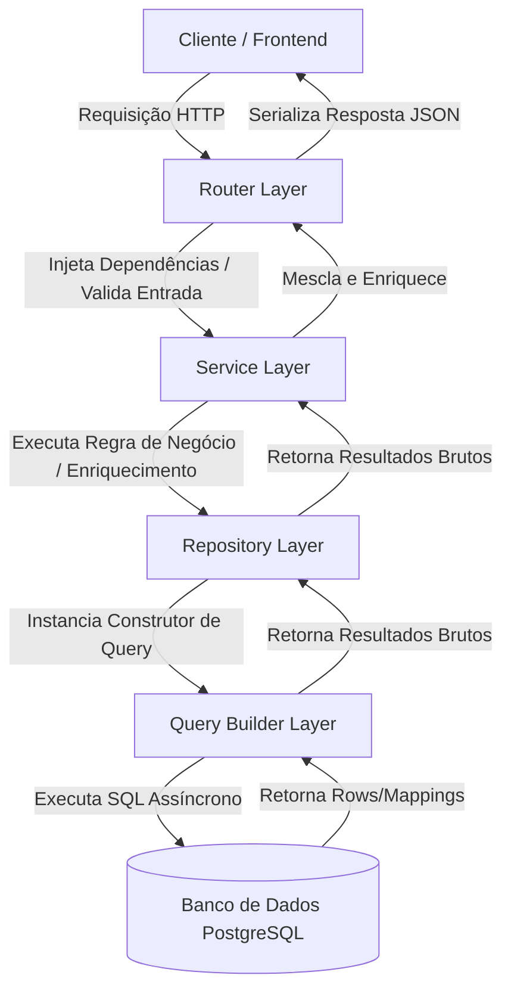

# Arquitetura de Endpoints e Camadas

Esta seção descreve a divisão de responsabilidades das camadas de software que compõem o processamento de uma requisição no SimCC.

## 1. Visão Geral da Arquitetura

O backend do SimCC é projetado para separar responsabilidades de rede, regras de negócio e acesso ao banco de dados em quatro camadas independentes. Essa separação garante que a lógica de banco (consultas analíticas complexas) não vaze para o controle HTTP e facilita o mock/teste individual de cada componente.

---

## 2. Divisão de Responsabilidades

### A. Rota (Router)
*   **Localização**: `src/simcc/routers/`
*   **Função**: Entrada da requisição HTTP (Controlador).
*   **Responsabilidades**:
    *   Definir rotas do FastAPI (ex: `@router.get('/my-endpoint')`).
    *   Injetar dependências compartilhadas (como a sessão do banco de dados `session` e usuário autenticado).
    *   Validar dados de entrada (query params e payloads do body).
    *   Serializar a resposta de saída utilizando esquemas do Pydantic (`response_model`).
    *   Delegar a execução imediata para a camada de Serviço.

### B. Serviço (Service)
*   **Localização**: `src/simcc/services/`
*   **Função**: Centralizador das regras de negócio.
*   **Responsabilidades**:
    *   Executar lógica de negócio intermediária.
    *   Orquestrar chamadas de banco de dados (ex: consultar a lista principal e depois realizar consultas paralelas para preencher detalhes complementares).
    *   Integrar com APIs e serviços externos.
    *   Formatar ou agregar estruturas de dados antes de devolvê-las ao roteador.

### C. Repositório (Repository)
*   **Localização**: `src/simcc/repositories/`
*   **Função**: Abstração de Acesso a Dados (DAO).
*   **Responsabilidades**:
    *   Isolar a manipulação do banco de dados e sessões do SQLAlchemy.
    *   Instanciar os construtores de queries dinâmicas, injetar parâmetros e acionar sua execução assíncrona.

### D. Construtores de Queries (Query Builders / SQL Dinâmico)
*   **Localização**: `src/simcc/queries/`
*   **Função**: Compilação de código SQL nativo para o banco de dados.
*   **Responsabilidades**:
    *   Como a aplicação executa junções e agregações analíticas massivas de produção científica, as consultas são geradas de forma dinâmica.
    *   Todas as classes de query devem herdar de `BaseQuery` (localizado em `src/simcc/queries/base.py`).
    *   Implementar o método `build_sql` e funções de filtros opcionais (ex: `_apply_institution_id_filter`).
