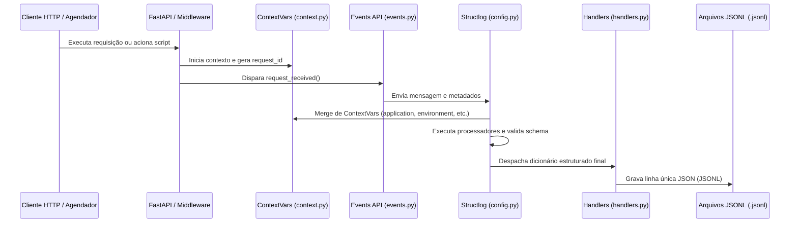

# Arquitetura de Observabilidade

Esta seção descreve os componentes e a comunicação do sistema de observabilidade estruturada do SimCC.

## 1. Visão Geral

A arquitetura de logging do SimCC foi desenhada sob os princípios de desacoplamento, baixo overhead em produção e consistência de dados. O fluxo de logs cruza todas as camadas do sistema de maneira automática, desde o recebimento de requisições HTTP e execução de rotinas, passando pelo contexto assíncrono e formatação, até o descarte/persistência física.

## 2. Fluxo Completo de Comunicação

O fluxo de logging segue a seguinte ordem sequencial de processamento:

---

## 3. Responsabilidade de Cada Camada

### A. FastAPI / Middleware
Responsável por capturar o ciclo de vida completo de cada transação de rede.
*   Gera um `request_id` único por transação.
*   Preenche o escopo assíncrono de variáveis (`contextvars`).
*   Mede o tempo gasto na requisição.
*   Emite logs nos eventos `request.received`, `request.finished` e `request.error`.

### B. ContextVars (`context.py`)
Central de armazenamento de escopo assíncrono.
*   Mantém metadados da transação ativos para qualquer log gerado na mesma thread assíncrona (como logs de repositórios e serviços) sem acoplamento manual.
*   Garante que o `request_id` e metadados HTTP sejam propagados implicitamente.

### C. Módulo de Eventos (`events.py` / `constants.py`)
Camada de abstração que impede o vazamento do Structlog para o código de negócio.
*   Expõe funções fortemente tipadas para cada evento suportado (ex: `routine_started`, `query_error`).
*   Garante nomenclatura correta e uniforme de categorias e eventos.

### D. Structlog (`config.py`)
Mecanismo de interceptação, enriquecimento e formatação.
*   Aplica filtros de nível de log (`LOG_LEVEL`).
*   Resolve automaticamente os enums para strings puras.
*   Molda e sanitiza a estrutura no schema JSON obrigatório (populando `data` e removendo SQLs em produção).

### E. Handlers (`handlers.py`)
Persistência e exportação física dos logs.
*   Determina o destino final do registro (atualmente arquivo `logs/YYYY-MM-DD.jsonl` e `stdout`).
*   Facilita a migração para coletores centralizados como Elasticsearch, Fluentd ou CloudWatch sem alterar o resto da aplicação.
