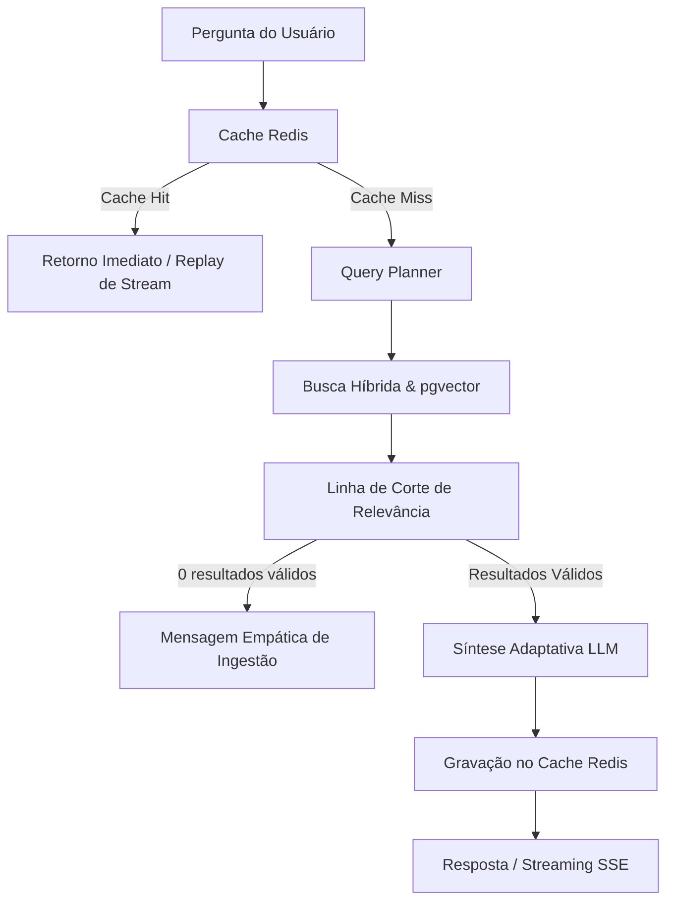

# Arquitetura de Inteligência Artificial e MarIA

O ecossistema do **SIMCC** integra uma camada avançada de inteligência artificial voltada para descoberta científica, consultas semânticas e síntese contextual de dados acadêmicos do estado da Bahia.

A assistente virtual **MarIA** atua como uma consultora inteligente capaz de interpretar perguntas em linguagem natural, planejar consultas estruturadas, cruzar bases vetoriais com filtros relacionais e gerar sínteses amigáveis e adaptativas.

---

## 🏛️ Visão Geral da Pipeline da MarIA

O fluxo conversacional da MarIA é organizado em cinco estágios desacoplados e observáveis:

### 1. Camada de Cache Distribuído (Redis)
- Antes de qualquer processamento pesado, a consulta tem seu hash canônico verificado no Redis (`simcc:ai:chat:...`).
- Suporta múltiplos workers da aplicação Uvicorn sem concorrência ou duplicação de chamadas ao provedor de IA.
- Oferece paridade total entre o endpoint de lote (`/ai/chat/ask`) e o endpoint de streaming (`/ai/chat/ask/stream`), reproduzindo os eventos do stream instantaneamente quando há *cache hit*.
- Possui mecanismo de *Graceful Fallback*: em caso de instabilidade na conexão com o Redis, a aplicação prossegue em modo direto sem interrupção de serviço.

### 2. Planejamento de Consulta (`QueryPlanner`)
- Extrai a intenção do usuário (`researcher_search`, `production_search`, `researcher_profile`, `researcher_comparison`, `aggregation`, `general_question`).
- Identifica filtros estruturados (siglas de instituições como UFBA, UNEB, UEFS, UESC; nomes de pesquisadores; tipos de produção e intervalos de anos).
- Gera uma query semântica purificada para a busca vetorial.

### 3. Busca Híbrida e Linha de Corte (`AISearchService`)
- Combina ordenação vetorial por distância cosseno (`pgvector`) com filtros relacionais SQL no PostgreSQL.
- **Linha de Corte de Relevância**: Aplica um limiar máximo de distância cosseno (`cosine_distance <= 0.65`). Registros fora da faixa de relevância são descartados para evitar ruído e alucinações.

### 4. Variações Adaptativas de Síntese e Sobriedade Científica
A MarIA ajusta dinamicamente a estrutura da resposta com base no perfil e volume dos dados recuperados, mantendo um tom amigável com o usuário, porém estritamente **sóbrio, factual e neutro** com os dados acadêmicos (sem adulações ou elogios vazios como "brilhante", "renomado" ou "ilustre"):

- **Modo Alto Volume (> 5 registros)**: Síntese panorâmica executiva destacando tendências e os principais dados no estado, convidando a refinar a busca.
- **Modo Volume Reduzido (1 a 4 registros)**: Análise detalhada, acolhedora e contextualizada de cada registro com foco em fatos e áreas de atuação.
- **Modo Heterogêneo / Multidisciplinar**: Agrupamento comparativo estruturado por instituição ou tipo de produção.
- **Modo Consultivo / Diálogo Temático (`thematic_chat`)**: Quando o usuário deseja entender um conceito científico, tirar dúvidas teóricas ou discutir metodologias sem pedir listagem na base, a MarIA atua como consultora científica, respondendo diretamente e convidando ao mapeamento de pesquisadores da Bahia ao final.
- **Modo Base em Indexação (0 registros ou pós-corte)**: Mensagem transparente e empática informando que a base de dados estadual está em constante processamento pelo Observatório SECTI e sugerindo termos alternativos.

### 5. Telemetria e Observabilidade (`AITracer`)
- Todas as execuções medem os tempos de cada estágio (`planner_ms`, `search_ms`, `cutoff_ms`, `synthesis_ms`).
- Emite logs estruturados JSONL na categoria `ai` em total conformidade com o padrão de observabilidade do projeto.

---

## ⚙️ Variáveis de Configuração

| Variável | Padrão | Descrição |
| :--- | :--- | :--- |
| `OPENAI_API_KEY` | `None` | Chave de API da OpenAI (opcional para testes com mocks; dispara HTTP 503 amigável se ausente em tempo de execução). |
| `REDIS_URL` | `redis://localhost:6379/0` | URL de conexão assíncrona com o cluster/instância Redis. |
| `REDIS_ENABLED` | `True` | Habilita ou desabilita a camada de cache. |
| `AI_CACHE_TTL` | `3600` | Tempo de vida (em segundos) para as respostas cacheadas de chat. |
| `AI_COSINE_DISTANCE_THRESHOLD` | `0.65` | Limiar de distância cosseno máxima para aceitação de documentos vetoriais. |

---

## 🧪 Estratégia de Testes

Os testes da camada de IA são 100% isolados de custos de tokens através de mocks (`MockLLMProvider`, `MockEmbeddingsProvider`):
- Testes unitários para planners, prompts, cache e telemetria: `tests/unit/ai/`, `tests/unit/core/`, `tests/unit/services/`.
- Testes de integração de rotas e contratos com o frontend: `tests/api/routers/`.
- Testes ponta a ponta com a API real da OpenAI são reservados para execução sob demanda com o marcador `@pytest.mark.ai_live`.
