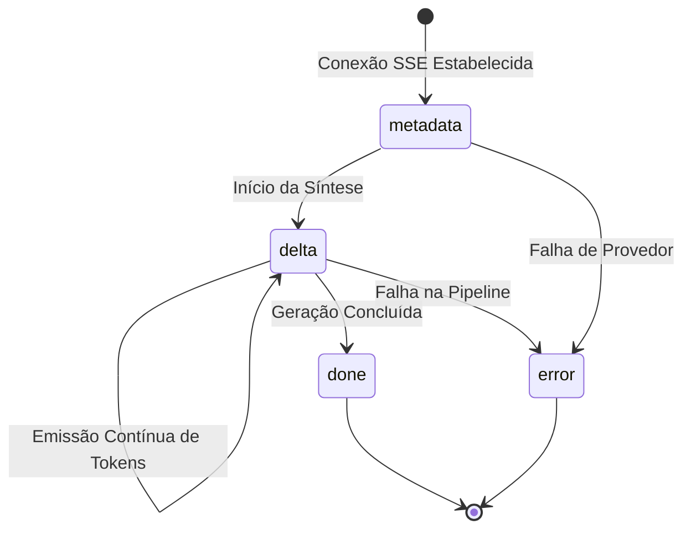

# Contratos de API e Streaming

Esta seção documenta a especificação técnica formal dos endpoints conversacionais da **MarIA** no SIMCC Backend. A preservação destes contratos é mandatória (conforme o **Princípio I** da Constituição do SIMCC e a história **US5** da especificação), garantindo compatibilidade total com o frontend em produção.

---

## 1. POST `/ai/chat/ask` (Modo Lote / Batch JSON)

Executa a pipeline completa e retorna a resposta final consolidada em um único payload JSON.

### Requisição
* **URL**: `/ai/chat/ask`
* **Método**: `POST`
* **Headers**: `Content-Type: application/json`

```json
{
  "query": "Quais pesquisadores da UFBA atuam com inteligência artificial?",
  "session_id": "sess_a81f4c2e-9821"
}
```

| Campo | Tipo | Obrigatório | Descrição |
|:---|:---|:---|:---|
| `query` | `string` | Sim | Texto livre com a pergunta ou termo de busca do usuário. |
| `session_id` | `string` | Não | Identificador de sessão para correlação de contexto e telemetria. |

---

### Respostas

#### 🟢 200 OK (Sucesso)
Retorna a resposta elaborada pela MarIA e as entidades científicas catalogadas:

```json
{
  "answer": "Na **Universidade Federal da Bahia (UFBA)**, identificamos pesquisadores de destaque com atuação em Inteligência Artificial, aprendizado de máquina e visão computacional...\n\n- **Dr. Exemplo**: Pesquisador com ênfase em modelos neurais aplicados à saúde.",
  "intent": "researcher_search",
  "filters_extracted": {
    "institutions": ["UFBA"],
    "production_types": []
  },
  "researchers": [
    {
      "id": "c71a39f0-2f64-4e20-951b-1d7b32408ec2",
      "name": "Dr. Exemplo",
      "institution": "Universidade Federal da Bahia",
      "institution_acronym": "UFBA",
      "lattes_id": "1234567890123456",
      "abstract": "Possui graduação em Ciência da Computação...",
      "semantic_content": "Inteligência Artificial, Aprendizado Profundo, Visão Computacional"
    }
  ],
  "productions": [],
  "sources": [
    "Dr. Exemplo (UFBA)"
  ]
}
```

#### 🟡 503 Service Unavailable (Sem API Key ou Provedor Indisponível)
Quando a variável de ambiente `OPENAI_API_KEY` não estiver definida ou o provedor externo de IA estiver indisponível:

```json
{
  "detail": "O serviço de inteligência artificial está temporariamente indisponível ou não configurado."
}
```

---

## 2. POST `/ai/chat/ask/stream` (Streaming via Server-Sent Events)

Permite transmissão em tempo real das palavras e parágrafos gerados pela MarIA, garantindo fluidez e reduzindo o tempo percebido de espera.

### Requisição
* **URL**: `/ai/chat/ask/stream`
* **Método**: `POST`
* **Headers**:
  * `Content-Type: application/json`
  * `Accept: text/event-stream`

```json
{
  "query": "Patentes registradas na área de biotecnologia na Bahia",
  "session_id": "sess_39b2e71c-4389"
}
```

---

### Protocolo de Eventos SSE (`text/event-stream`)

O stream emite eventos no formato padrão `data: <JSON>\n\n`, obedecendo rigorosamente à seguinte máquina de estados:



#### Evento 1: `metadata`
Emitido imediatamente após a busca vetorial e antes da geração do texto. Contém a intenção extraída, filtros e entidades encontradas para renderização visual imediata no frontend:

```text
data: {"type": "metadata", "message_id": "sess_39b2e71c-4389", "data": {"intent": "production_search", "filters": {"production_types": ["PATENT"]}, "researchers": [], "productions": [{"id": "pat-01", "title": "Processo de Extração de Biopolímeros a partir de Resíduos de Cacau", "type": "PATENT", "year": "2023"}], "sources": ["Processo de Extração de Biopolímeros... [PATENT] (2023)"]}}

```

#### Eventos 2 a N: `delta`
Fragmentos de texto enviados incrementalmente à medida que o modelo sintetiza a resposta:

```text
data: {"type": "delta", "message_id": "sess_39b2e71c-4389", "content": "No ecossistema de inovação da **Bahia**, "}

data: {"type": "delta", "message_id": "sess_39b2e71c-4389", "content": "foram catalogadas patentes relevantes no segmento de biotecnologia..."}

```

#### Evento Final de Sucesso: `done`
Sinaliza ao frontend o encerramento da transmissão:

```text
data: {"type": "done", "message_id": "sess_39b2e71c-4389"}

```

#### Evento em Caso de Falha: `error`
Emitido caso ocorra timeout, interrupção ou ausência de credenciais durante a pipeline:

```text
data: {"type": "error", "message_id": "sess_39b2e71c-4389", "code": "ai_unavailable", "message": "O serviço de inteligência artificial está temporariamente indisponível."}

```
