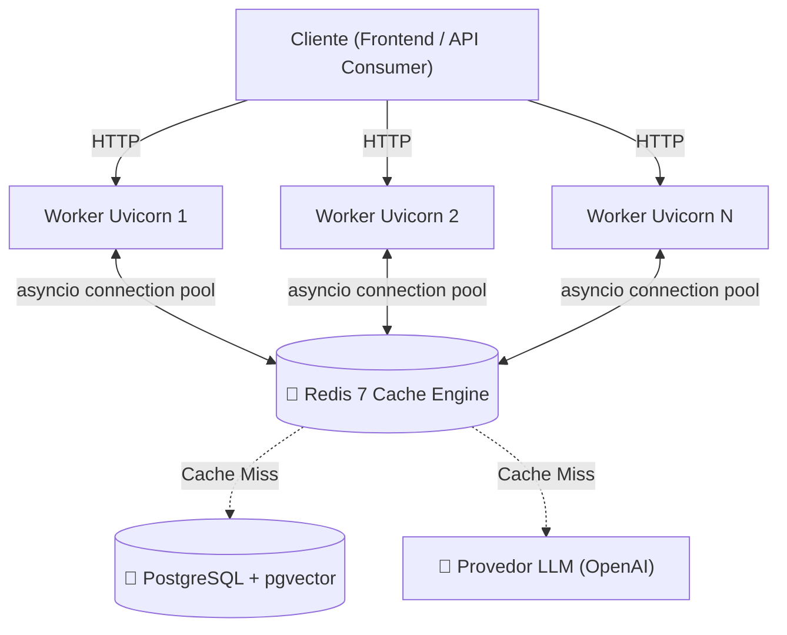
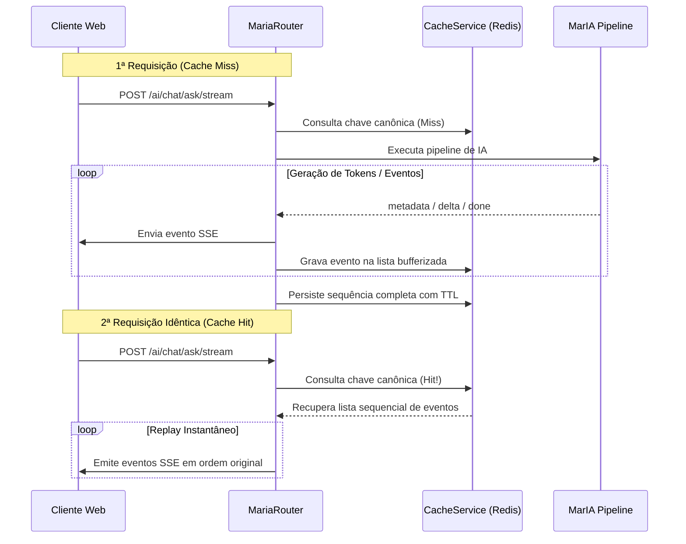

# Cache Distribuído e Telemetria Contínua

A alta disponibilidade e o desempenho do SIMCC em ambientes concorrentes dependem de dois pilares complementares: a camada de **Cache Distribuído com Redis** e a **Telemetria Estruturada da Pipeline de IA**.

---

## ⚡ Cache Distribuído com Redis

Em ambientes de produção com 4 a 6 workers assíncronos do Uvicorn, caches locais em memória (`lru_cache`) causam inconsistência e chamadas redundantes a APIs externas. O SIMCC adota o Redis como barramento central de aceleração.



### Principais Características

* **Cliente Assíncrono Não-Bloqueante**: Implementado com `redis.asyncio` através do [`RedisClient`](file:///home/jaspion/Observatorio/Simcc/simcc-back/src/simcc/core/cache/redis_client.py), utilizando pool de conexões reutilizável.
* **Isolamento por Namespaces**: Chaves prefixadas (ex: `simcc:ai:chat:hash_da_query`) evitam colisões entre diferentes módulos do sistema.
* **Política de Expiração (TTL)**: Configurada centralmente via `REDIS_CACHE_TTL_SECONDS` (padrão de 3600 segundos / 1 hora).
* **Degradação Graciosa (Graceful Fallback)**: Caso o Redis fique temporariamente indisponível ou sofra timeout de rede, a aplicação emite um log estruturado de aviso (`warning`) e processa a requisição diretamente, garantindo 0% de interrupção ao usuário final.

---

## 🌊 Replay de Streaming SSE via Cache

Uma das inovações da arquitetura é o suporte transparente a cache no endpoint Server-Sent Events (`/ai/chat/ask/stream`):



Quando uma consulta idêntica é solicitada em streaming, os eventos `metadata`, `delta` e `done` são reemitidos em ordem, proporcionando uma experiência idêntica de digitação sem custo de processamento ou tokens de LLM.

---

## 📊 Telemetria Estruturada e Observabilidade (JSONL)

Em estrita conformidade com o **Princípio V da Constituição do SIMCC**, a pipeline conversacional gera registros de diagnóstico detalhados a cada interação.

### Ciclo de Coleta do `AITracer`

O [`AITracer`](file:///home/jaspion/Observatorio/Simcc/simcc-back/src/simcc/ai/telemetry/tracer.py) cronometra a latência individual de cada fase do processamento:

1. **`planner`**: Duração da análise sintática e geração do `QueryPlan`;
2. **`search`**: Tempo de execução da busca vetorial no `pgvector`;
3. **`cutoff`**: Tempo de avaliação e filtragem de distância cosseno;
4. **`synthesis`**: Tempo de invocação e resposta do modelo de linguagem;
5. **`total`**: Tempo de resposta ponta a ponta percebido pela aplicação.

### Exemplo de Log Estruturado

Os logs são emitidos na categoria fixa `ai` no formato JSONL com metadados de correlação:

```json
{
  "timestamp": "2026-09-03T21:10:00.123456Z",
  "level": "INFO",
  "application": "simcc-back",
  "environment": "production",
  "hostname": "simcc-api-worker-01",
  "category": "ai",
  "event": "ai_pipeline_completed",
  "message": "Interação de chat concluída com sucesso pela MarIA",
  "request_id": "req-9b3c4f72-8a1e",
  "duration": 0.428,
  "data": {
    "query": "Pesquisadores em biotecnologia marinha",
    "intent": "researcher_search",
    "cache_hit": false,
    "cutoff_threshold": 0.65,
    "raw_documents_found": 8,
    "documents_after_cutoff": 4,
    "prompt_variation": "variation_b_reduced",
    "stage_latencies_ms": {
      "planner": 82.5,
      "search": 45.1,
      "cutoff": 1.2,
      "synthesis": 298.3
    },
    "tokens": {
      "prompt_tokens": 640,
      "completion_tokens": 185,
      "total_tokens": 825,
      "estimated_cost_usd": 0.00034
    }
  }
}
```

### Estimativa de Custos (`PricingService`)
O módulo [`pricing.py`](file:///home/jaspion/Observatorio/Simcc/simcc-back/src/simcc/ai/telemetry/pricing.py) computa os custos financeiros de cada chamada baseado na precificação vigente dos modelos (`gpt-4o-mini`, `text-embedding-3-small`), permitindo auditoria detalhada de economia de custos viabilizada pelo cache Redis.
