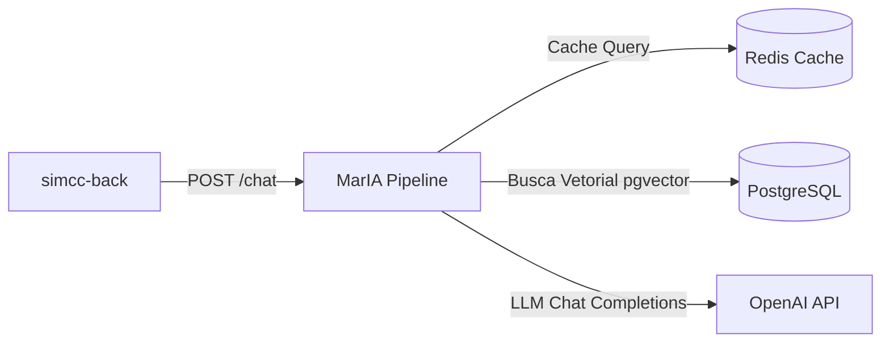

# Arquitetura de Observabilidade e Visualização de Traces

O SIMCC Backend adota uma estratégia moderna, vendor-neutral e orientada a padrões abertos para observabilidade, integrando **OpenTelemetry (OTel)**, **Jaeger UI** e **Logs Estruturados JSONL**.

```mermaid
graph TD
    A["Cliente / Frontend"] -->|Requisição HTTP com W3C TraceContext| B["FastAPI Endpoint"]
    B -->|Logs Diários com trace_id| C["Arquivo logs/YYYY-MM-DD.jsonl"]
    B -->|Spans Raiz HTTP| D["TracerProvider (simcc.core.telemetry)"]
    B -->|Pipeline MarIA| E["AITracer (simcc.ai.telemetry)"]
    E -->|ai.planner| D
    E -->|ai.search / pgvector| D
    E -->|ai.cutoff| D
    E -->|ai.synthesis| D
    D -->|Sanitizing Processor| F["BatchSpanProcessor"]
    F -->|OTLP gRPC (porta 4317)| G["Jaeger All-in-One"]
    G -->|Interface Web Interativa| H["Navegador: http://localhost:16686"]
```

---

## 1. Como Subir a Infraestrutura Necessária

A infraestrutura de visualização e tracing distribuído está totalmente integrada ao Docker Compose do projeto através do **Jaeger All-in-One**.

### A. Subindo o Jaeger com Docker Compose

Para iniciar o serviço do Jaeger em segundo plano:

```bash
docker compose up -d jaeger
```

Caso queira subir todo o ecossistema (PostgreSQL com `pgvector`, Redis e Jaeger):

```bash
docker compose up -d db redis jaeger
```

### B. Portas Expostas pelo Jaeger

| Porta | Protocolo | Finalidade |
|:---|:---|:---|
| **`16686`** | HTTP | **Interface Gráfica Web do Jaeger** (`http://localhost:16686`) |
| **`4317`** | gRPC | **Receptor OTLP nativo** (onde a API SIMCC envia os spans assincronamente) |
| **`4318`** | HTTP | Receptor OTLP via HTTP/Protobuf |

---

## 2. Como Conectar a API ao Jaeger

### Modo 1: Desenvolvimento Local (Terminal)

Ao rodar a API diretamente na sua máquina via Poetry, configure as variáveis de ambiente no seu `.env` ou exporte no terminal:

```bash
export OTEL_ENABLED=true
export OTEL_EXPORTER_TYPE=otlp
export OTEL_EXPORTER_OTLP_ENDPOINT=http://localhost:4317
export OTEL_EXPORTER_OTLP_INSECURE=true
```

Inicie o servidor de desenvolvimento:

```bash
poetry run task run
```

### Modo 2: Execução Total via Docker Compose

Se a API estiver rodando dentro do Docker, a comunicação é automática através da rede interna do Compose (`http://jaeger:4317`), já configurada no [`compose.yaml`](file:///home/jaspion/Observatorio/Simcc/simcc-back/compose.yaml):

```bash
docker compose up -d
```

---

## 3. Como Visualizar e Interpretar os Gráficos no Jaeger UI

Abra o seu navegador em:

👉 **[http://localhost:16686](http://localhost:16686)**

---

### A. Busca e Gráfico de Dispersão de Latência (Scatter Plot)

Na aba **Search** do painel esquerdo:

1. Selecione o serviço **`simcc-back`** no campo *Service*;
2. (Opcional) Escolha uma operação específica no campo *Operation* (ex: `POST /ai/chat/ask`, `POST /ai/chat/ask/stream` ou `ai.pipeline`);
3. Clique em **Find Traces**.

```text
┌─────────────────────────────────────────────────────────────────────────────┐
│  Jaeger UI - Latency Scatter Plot                                          │
│                                                                             │
│  ms ▲                                                                       │
│     │          ● (1420ms - Cache Miss)                                      │
│     │                                                                       │
│     │                                                                       │
│     │  ● (32ms - Cache Hit)      ● (45ms)       ● (28ms)                    │
│     └────────────────────────────────────────────────────────────────────►  │
│        10:00                    10:05                   10:10       Hora    │
└─────────────────────────────────────────────────────────────────────────────┘
```

* **Círculos Azuis**: Requisições bem-sucedidas (`StatusCode.OK`);
* **Círculos Vermelhos**: Requisições com falhas ou exceções (`StatusCode.ERROR`);
* **Eixo Vertical (Y)**: Duração total em milissegundos;
* **Eixo Horizontal (X)**: Linha do tempo de ocorrência.

---

### B. Gráfico em Cascata (Trace Waterfall / Gantt Chart)

Ao clicar em qualquer trace da lista, o Jaeger renderiza o gráfico em cascata completo, permitindo auditar o tempo exato consumido por cada componente da pipeline da MarIA:

```text
Trace: 4bf92f3577b34da6a3ce929d0e0e4736 (1.42s)
--------------------------------------------------------------------------------------
POST /ai/chat/ask                  ████████████████████████████████████████  1.42s
├── redis.get                      █                                         1.2ms
└── ai.pipeline                    ████████████████████████████████████████  1.41s
    ├── ai.planner                 ███                                       84ms
    ├── pgvector.search            ████████                                  310ms
    │   └── db.query (PostgreSQL)  ████████                                  305ms
    ├── ai.cutoff                  ▏                                         0.4ms
    └── ai.synthesis               █████████████████████████                 980ms
        └── HTTP POST api.openai   █████████████████████████                 975ms
```

#### O que você consegue inspecionar ao clicar em cada span:
* **`ai.pipeline`**: Duração total da IA, metadados de intenção (`ai.intent`), modelo (`ai.model="gpt-4o-mini"`) e flag de cache (`ai.cache_hit=false`);
* **`ai.planner`**: Tempo de classificação da intenção do usuário e extração de filtros estruturados;
* **`ai.search` / `pgvector.search`**: Tempo de execução da consulta vetorial e quantidade de documentos encontrados (`ai.retrieval.documents_found`);
* **`ai.cutoff`**: Ponto de corte semântico aplicado, documentos mantidos e quantidade descartada (`ai.retrieval.dropped_count`);
* **`ai.synthesis`**: Tempo de geração da resposta pelo modelo de linguagem e tokens consumidos.

---

### C. Grafo de Dependências e Arquitetura do Sistema (System Architecture DAG)

No menu superior do Jaeger, clique em **System Architecture** e selecione a aba **DAG**:



O Jaeger calcula e desenha automaticamente o mapa de dependências em tempo real, calculando a taxa de tráfego e latência média entre os componentes.

---

## 4. Coexistência com Logs JSONL

A introdução do OpenTelemetry **não substitui** o sistema existente de logs JSONL em disco (`logs/YYYY-MM-DD.jsonl`).

Toda linha de log gerada pelo structlog recebe automaticamente a correlação:

```json
{
  "timestamp": "2026-09-04T00:15:20.124Z",
  "level": "INFO",
  "application": "simcc",
  "category": "ai",
  "event": "ai.pipeline.completed",
  "message": "Pipeline de IA concluída em 1418.5ms (cache_hit=False)",
  "request_id": "9b1deb4d-3b7d-4bad-9bdd-2b0d7b3dcb6d",
  "duration": 1418.5,
  "data": {
    "trace_id": "4bf92f3577b34da6a3ce929d0e0e4736",
    "span_id": "00f067aa0ba902b7",
    "intent": "researcher_search",
    "final_count": 5
  }
}
```

Copie o valor de `trace_id` do log JSONL e cole na barra de busca do Jaeger para abrir instantaneamente o gráfico daquela requisição.

---

## 5. Diferença entre Traces e Métricas (Resolução de Erros OTLP)

> [!NOTE]
> **Por que o Jaeger acusa `StatusCode.UNIMPLEMENTED` para métricas?**  
> O Jaeger All-in-One é um backend especializado exclusivamente em **rastreamento distribuído (Traces)**.  
> Na porta `4317` (gRPC), ele implementa o serviço `TraceService`, mas **não** implementa o `MetricsService`.  
> Por isso, o SIMCC possui configurações independentes:
> * `OTEL_EXPORTER_TYPE=otlp`: direciona traces para o Jaeger (`http://localhost:4317`);
> * `OTEL_METRICS_EXPORTER_TYPE=none`: mantém as métricas registradas em processo/memória sem tentar empurrá-las para um endpoint que não aceita métricas.

### Tabela de Configurações de Exportação

| Variável | Valor Padrão | Descrição |
|:---|:---|:---|
| `OTEL_ENABLED` | `true` | Habilita/desabilita toda a instrumentação de telemetria |
| `OTEL_EXPORTER_TYPE` | `console` | Destino dos **traces** (`console`, `otlp`, `in_memory`, `none`) |
| `OTEL_METRICS_EXPORTER_TYPE` | `none` | Destino das **métricas** (`none`, `console`, `otlp`, `in_memory`) |
| `OTEL_EXPORTER_OTLP_ENDPOINT` | `http://localhost:4317` | Endereço gRPC do receptor OTLP |
| `OTEL_EXPORTER_OTLP_INSECURE` | `true` | Utiliza conexão gRPC sem TLS/SSL (ideal para dev e rede interna) |

Caso no futuro o projeto venha a utilizar um **OpenTelemetry Collector** completo ou **Prometheus** com receptor OTLP ativo, basta alterar `OTEL_METRICS_EXPORTER_TYPE=otlp`.
