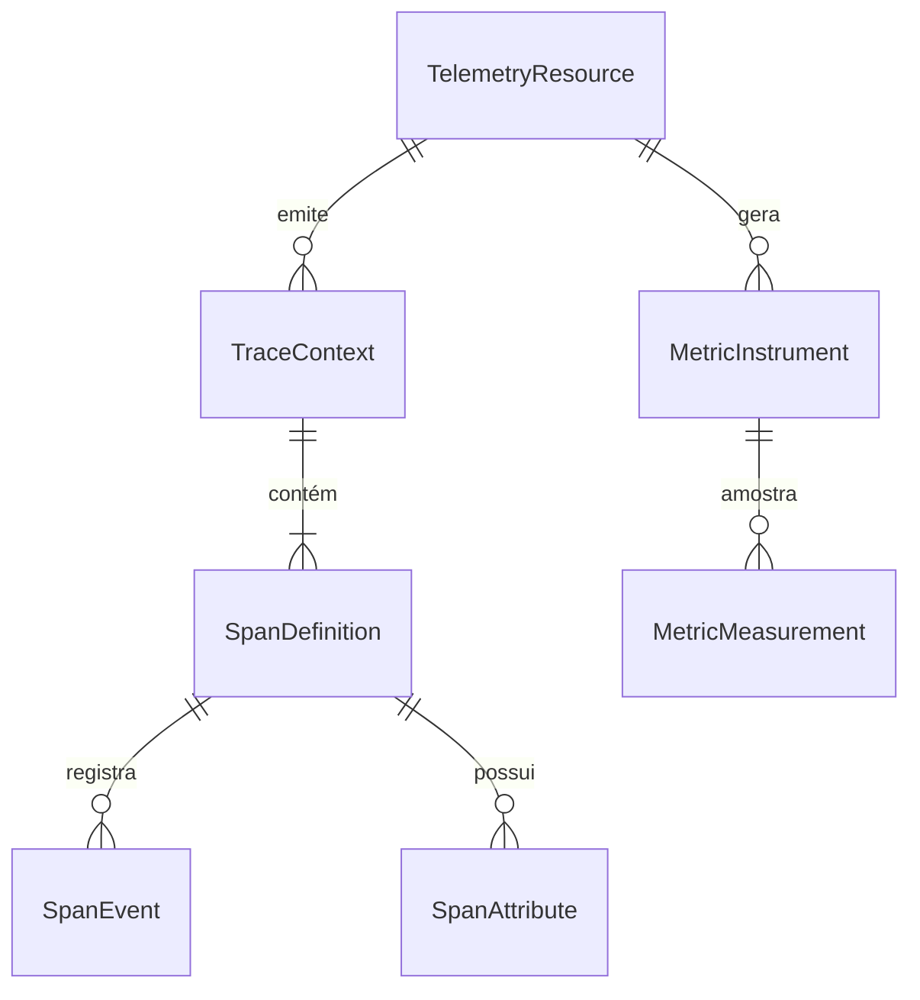

# Data Model & Telemetry Entities: OpenTelemetry no SIMCC

**Feature**: `002-opentelemetry-tracing`  
**Date**: 2026-09-03  
**Status**: Completed

Este documento especifica o modelo conceitual de entidades, atributos e relações para a observabilidade estruturada com OpenTelemetry no SIMCC Backend.

---

## 1. Diagrama de Relações de Entidades de Telemetria

---

## 2. Entidades Conceituais

### A. `TelemetryResource`
Representa a identidade imutável do serviço emissor perante o ecossistema de observabilidade.

* **Campos**:
  * `service.name` (`string`): Fixo em `"simcc-back"`.
  * `service.namespace` (`string`): Fixo em `"simcc"`.
  * `service.version` (`string`): Versão semântica da aplicação (ex: `"4.5.0"`).
  * `deployment.environment.name` (`string`): Ambiente ativo (`"development"`, `"production"`, `"test"`).
  * `service.instance.id` (`string`): Identificador único da réplica/worker (hostname do container).

---

### B. `TraceContext`
Encapsula os identificadores de propagação de contexto distribuído vinculados à requisição ativa no loop assíncrono.

* **Campos**:
  * `trace_id` (`string`, hex 32 chars): Identificador global exclusivo que conecta todos os spans gerados em uma mesma transação.
  * `span_id` (`string`, hex 16 chars): Identificador do span ativo corrente.
  * `trace_flags` (`integer`): Flags de amostragem (`01` para sampled).
  * `request_id` (`string`): UUID de correlação da requisição HTTP (mantido sincronizado com `x-request-id` e os logs JSONL).

---

### C. `SpanDefinition`
Representa uma unidade de trabalho delimitada temporalmente na execução do sistema.

* **Campos**:
  * `name` (`string`): Nome lógico da operação (ex: `POST /ai/chat/ask`, `ai.planner`, `pgvector.search`, `redis.get`).
  * `kind` (`SpanKind`): Tipo de span conforme OpenTelemetry (`SERVER`, `INTERNAL`, `CLIENT`).
  * `start_time` / `end_time` (`timestamp UTC`): Marcações de início e fim da operação.
  * `status` (`StatusCode`): `"UNSET"`, `"OK"` ou `"ERROR"`.
  * `attributes` (`dict[str, Any]`): Metadados estruturados aderentes às Semantic Conventions.

#### Tipos de Spans Principais no SIMCC

| Nome do Span | Kind | Componente | Atributos Principais |
|:---|:---|:---|:---|
| `HTTP {method} {route}` | `SERVER` | FastAPI Router | `http.request.method`, `http.route`, `http.response.status_code`, `client.address` |
| `ai.pipeline` | `INTERNAL` | `MariaService` | `ai.model`, `ai.intent`, `ai.cache_hit`, `ai.total_duration_ms` |
| `ai.planner` | `INTERNAL` | `QueryPlanner` | `ai.stage="planner"`, `ai.extracted_intent`, `ai.filter_count` |
| `ai.retrieval` | `INTERNAL` | `AISearchService` | `ai.stage="retrieval"`, `ai.retrieval.documents_found` |
| `ai.cutoff` | `INTERNAL` | `CutoffPolicy` | `ai.stage="cutoff"`, `ai.retrieval.cutoff_threshold`, `ai.retrieval.documents_after_cutoff` |
| `ai.synthesis` | `INTERNAL` | LLM Provider | `ai.stage="synthesis"`, `ai.prompt_variation`, `gen_ai.usage.input_tokens`, `gen_ai.usage.output_tokens` |
| `pgvector.search` / `db.query` | `CLIENT` | PostgreSQL | `db.system="postgresql"`, `db.name="simcc_db"`, `db.operation` |
| `redis.{command}` | `CLIENT` | Redis Cache | `db.system="redis"`, `db.operation="GET"|"SET"`, `cache.hit=boolean` |
| `HTTP {method} {host}` | `CLIENT` | HTTPX (OpenAI) | `http.request.method`, `server.address`, `http.response.status_code` |

---

### D. `MetricInstrument`
Representa uma métrica agregada para medição contínua da saúde e performance da aplicação.

* **Campos**:
  * `name` (`string`): Nome padronizado da métrica (ex: `http.server.request.duration`, `simcc.ai.requests`).
  * `type` (`string`): Tipo de instrumento (`Histogram`, `Counter`).
  * `unit` (`string`): Unidade de medida (ex: `"ms"`, `"1"`, `"{tokens}"`).
  * `description` (`string`): Descrição do propósito da métrica.
  * `allowed_dimensions` (`list[str]`): Conjunto estrito e finito de rótulos permitidos (baixa cardinalidade).

---

### E. `TelemetryConfiguration`
Modelo de configuração e validação dos parâmetros de observabilidade gerenciados via `pydantic-settings`.

* **Campos**:
  * `OTEL_ENABLED` (`bool`, default: `True`): Ativa ou desativa a instrumentação.
  * `OTEL_EXPORTER_TYPE` (`str`, default: `"console"`): Destino (`"console"`, `"otlp"`, `"none"`).
  * `OTEL_EXPORTER_OTLP_ENDPOINT` (`str`, default: `"http://localhost:4317"`): Endpoint gRPC ou HTTP do Collector.
  * `OTEL_EXPORTER_OTLP_INSECURE` (`bool`, default: `True`): Uso de TLS para conexão OTLP.
  * `OTEL_SAMPLING_RATIO` (`float`, default: `1.0`): Taxa de amostragem de traces (0.0 a 1.0).
  * `OTEL_LOG_CORRELATION` (`bool`, default: `True`): Injeta `trace_id` nos logs JSONL.
